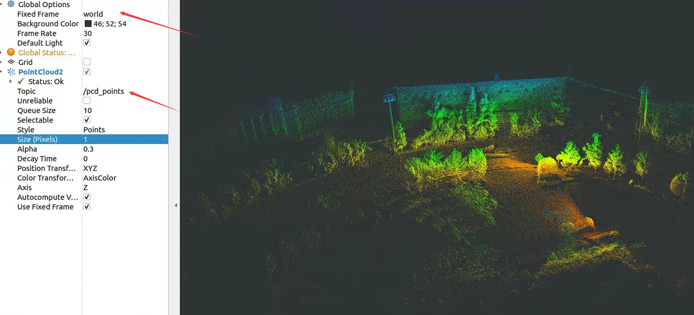

# pcd_rviz_viewer

## install

```
mkdir -p ~/catkin_ws/src
cd ~/catkin_ws/src
git clone https://github.com/kafeiyin00/pcd_rviz_viewer.git
cd ..
catkin_make
```

# use

```
rosrun pcd_rviz_viewer view_pcd_node "PATH_TO_PCD" 

```

## visualize in RVIZ

